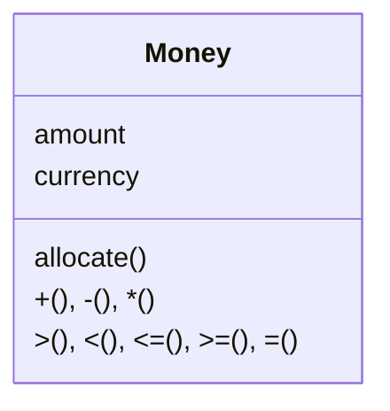

[](https://github.com/kaiosilveira/poeaa-money/actions/workflows/dotnet.yml)

ℹ️ _This repository is part of my "Patterns of Enterprise Application Architecture" (PoEAA) catalog, based on Martin Fowler's book with the same title. For my full work on the topic, see [kaiosilveira/poeaa](https://github.com/kaiosilveira/patterns-of-enterprise-application-architecture)_

---

# Money

Represents a monetary value.



## Implementation example

Sticking to the book's example, we're going to implement a `Money` class that's currency-aware and contains logic to perform arithmetics, equality/inequality comparisons, and also has an allocation strategy.

## Implementation considerations

There are several considerations and concerns when it comes to implementing `Money`, some of them are detailed below.

### Rounding

When implementing `Money`, one of the biggest concerns that comes to mind is rounding. There are multiple ways of addressing this concern, such as defaulting to a predefined rounding strategy (and hopefully making it explicit to external clients), or allowing the clients themselves to choose how to round.

### Arithmetics

Another concern is arithmetics: in real life, we're used to adding and subtracting monies naturally. One way of representing that in code is by overriding the "+" and "-" operators, so we can do things like `oneEuro + twoEuros` like they were scalars.

### Equality

Continuing with the idea introduced above, handling comparisons between two different money objects could be as natural and intuitive as `oneEuro < twoEuros`.

### Allocation

Distributing a certain amount of money to different parts with different ratios involved is one of the biggest concerns when working with `Money`, hence Foemmel's conundrum:

> Suppose I have a business rule that says that I have to allocate the whole amount of a sum of money to two accounts: 70% to one and 30% to another. I have 5 cents to allocate. If I do the math I end up with 3.5 cents and 1.5 cents. Whichever way I round these I get into trouble. If I do the usual rounding to nearest then 1.5 becomes 2 and 3.5 becomes 4. So I end up gaining a penny. Rounding down gives me 4 cents and rounding up gives me 6 cents. There's no general rounding scheme I can apply to both that will avoid losing or gaining a penny.

There are several possible solutions for this problem, and we're going to implement the authors' favorite one.

## Test suite

In a good [TDD](https://github.com/kaiosilveira/test-driven-development) fashion, unit tests were used to guide this implementation, covering the main considerations listed above.

### Basic capabilities

The most basic capability we need from `Money` is holding an amount for a certain currency:

```csharp
public class MoneyTests_BasicInfo
{
    [Fact]
    public void TestHasAmountAndCurrency()
    {
        var money = new Money(amount: 10, currency: Currency.BRL);
        Assert.Equal(10, money.Amount);
        Assert.Equal(Currency.BRL, money.Currency);
    }
}
```

### Shortcuts

Some shortcuts for instantiating monies of a specific currency are also handy:

```csharp
public class MoneyTests_Shortcuts
{
    [Fact]
    public void TestCreatesAnUSD()
    {
        var money = Money.Dollars(amount: 10);
        Assert.Equal(Currency.USD, money.Currency);
    }

    [Fact]
    public void TestCreatesBRL()
    {
        var money = Money.BrasilianReal(amount: 10);
        Assert.Equal(Currency.BRL, money.Currency);
    }

    [Fact]
    public void TestCreatesEUR()
    {
        var money = Money.Euros(amount: 10);
        Assert.Equal(Currency.EUR, money.Currency);
    }
}
```

### Arithmetics

Then, we can move on to arithmetics:

```csharp
public class MoneyTests_Arithmetics
{
    [Fact]
    public void TestAddsUp()
    {
        var tenEuros = Money.Euros(amount: 10);
        var twentyEuros = Money.Euros(amount: 20);
        var thirtyEuros = Money.Euros(amount: 30);
        Assert.Equal(thirtyEuros, tenEuros + twentyEuros);
    }

    [Fact]
    public void TestCannotAddDifferentCurrencies()
    {
        var tenEuros = Money.Euros(amount: 10);
        var tenDollars = Money.Dollars(amount: 10);
        Assert.Throws<InvalidOperationException>(() => tenEuros + tenDollars);
    }

    [Fact]
    public void TestSubtracts()
    {
        var thirtyEuros = Money.Euros(amount: 30);
        var tenEuros = Money.Euros(amount: 10);
        var twentyEuros = Money.Euros(amount: 20);
        Assert.Equal(twentyEuros, thirtyEuros - tenEuros);
    }

    [Fact]
    public void TestCannotSubtractDifferentCurrencies()
    {
        var tenEuros = Money.Euros(amount: 10);
        var tenDollars = Money.Dollars(amount: 10);
        Assert.Throws<InvalidOperationException>(() => tenEuros - tenDollars);
    }

    [Fact]
    public void TestMultiplication()
    {
        var tenEuros = Money.Euros(amount: 10);
        var twentyEuros = Money.Euros(amount: 20);
        Assert.Equal(twentyEuros, tenEuros * 2);
    }

    [Fact]
    public void TestRoundsToHalfEvenWhenMultiplying()
    {
        var oneEuro = Money.Euros(amount: 1);
        Assert.Equal(Money.Euros(amount: 2.76m), oneEuro * 2.756m);
        Assert.Equal(Money.Euros(amount: 2.75m), oneEuro * 2.754m);
    }
}
```

### Equality

We're also concerned about equality and inequality:

```csharp
public class MoneyTests_Equality
{
    [Fact]
    public void TestIsEqualSameAmountSameCurrency()
    {
        var tenEuros1 = Money.Euros(amount: 10);
        var tenEuros2 = Money.Euros(amount: 10);
        Assert.Equal(tenEuros1, tenEuros2);
    }

    [Fact]
    public void TestIsNotEqualDifferentAmountSameCurrency()
    {
        var tenEuros = Money.Euros(amount: 10);
        var twentyEuros = Money.Euros(amount: 20);
        Assert.NotEqual(tenEuros, twentyEuros);
    }

    [Fact]
    public void TestIsNotEqualSameAmountDifferentCurrency()
    {
        var tenEuros = Money.Euros(amount: 10);
        var tenDollars = Money.Dollars(amount: 10);
        Assert.NotEqual(tenEuros, tenDollars);
    }
}

public class MoneyTests_Inequality
{
    [Fact]
    public void TestGreaterThanComparisons()
    {
        var tenEuros = Money.Euros(amount: 10);
        var elevenEuros = Money.Euros(amount: 11);

        Assert.True(elevenEuros > tenEuros);
        Assert.True(tenEuros < elevenEuros);
    }

    [Fact]
    public void TestCannotCompareDifferentCurrencies()
    {
        var tenEuros = Money.Euros(amount: 10);
        var tenDollars = Money.Dollars(amount: 10);
        Assert.Throws<InvalidOperationException>(() => tenEuros > tenDollars);
    }
}
```

### Allocation

And, finally, we have allocation:

```csharp
public class MoneyTests_Allocation
{
    [Fact]
    public void TestAllocation()
    {
        var tenEuros = Money.Euros(amount: 10);
        var allocated = tenEuros.Allocate(ratios: [1, 1, 1]);
        Assert.Equal(Money.Euros(amount: 3.34m), allocated[0]);
        Assert.Equal(Money.Euros(amount: 3.33m), allocated[1]);
        Assert.Equal(Money.Euros(amount: 3.33m), allocated[2]);
    }

    [Fact]
    public void TestSolvesFoemmelsConundrum()
    {
        var amount = Money.Euros(amount: 0.05m);
        var allocated = amount.Allocate(ratios: [3, 7]);
        Assert.Equal(Money.Euros(amount: 0.02m), allocated[0]);
        Assert.Equal(Money.Euros(amount: 0.03m), allocated[1]);
    }
}
```

Note that we're covering Foemmel's conundrum in a specific test. Our goal is to address this problem as part of this implementation.

These test suites are implemented at [PoeAAMoney.Tests/src/Money](./PoEAAMoney.Tests/src/Money), check it out for more details.

## Implementation details

Let's now dive a little deeper into the implementation that satisfies the unit tests above.

We can start by introducing a `Currency` enumerator, with some basic currencies:

```csharp
public enum Currency
{
    BRL,
    USD,
    EUR
}
```

Now, on to our `Money` class, we can define properties for `Currency`, `Amount` and `RoundingMode`:

```csharp
public class Money
{
    public readonly Currency Currency;
    private readonly MidpointRounding RoundingMode;
    private decimal amount;
    public decimal Amount
    {
        get { return Round(amount / GetCentsFactor[Currency]); }
        set { amount = Round(value * GetCentsFactor[Currency]); }
    }

    public Money(decimal amount, Currency currency, MidpointRounding roundingMode = MidpointRounding.ToEven)
    {
        Amount = amount;
        Currency = currency;
        RoundingMode = roundingMode;
    }
}
```

Notice how we're using a `GetCentsFactor` dictionary to convert the external `amount` into an internal representation based on cents (the smallest unit). We're also resorting to `Round` as a way to keep the `amount` consistent in the implementation boundaries. The `Round` function itself is pretty straightforward:

```csharp
public class Money
{
    // more code above...

    private decimal Round(decimal amount)
    {
        return Math.Round(amount, RoundingMode);
    }
}
```

### Shortcuts

To implement the shortcuts, we can provide static methods with the currency name which returns a new `Money` class with the target `Currency`:

```csharp
public class Money
{
    // more code above...

    public static Money Dollars(decimal amount) => new(amount, Currency.USD);

    public static Money BrasilianReal(decimal amount) => new(amount, Currency.BRL);

    public static Money Euros(decimal amount) => new(amount, Currency.EUR);
}
```

### Equality

To handle equality, we can override `Equals` and `GetHashCode`:

```csharp
public class Money
{
    // more code above...

    public override int GetHashCode() => HashCode.Combine(Amount, Currency);

    public override bool Equals(object? obj)
    {
        if (obj is not Money other) return false;
        return Amount == other.Amount && Currency == other.Currency;
    }
}
```

### Arithmetics

Arithmetics can be elegantly implemented in C#, by overriding the "+", "-", and "\*" operators:

```csharp
public class Money {
    // more code above

    public static Money operator +(Money a, Money b)
    {
        AssertSameCurrency(a, b);
        return new Money(a.Amount + b.Amount, a.Currency);
    }

    public static Money operator -(Money a, Money b)
    {
        AssertSameCurrency(a, b);
        return new Money(a.Amount - b.Amount, a.Currency);
    }

    public static Money operator *(Money a, decimal factor)
    {
        return new Money(a.Amount * factor, a.Currency);
    }
}
```

### Inequality

We can use the same overriding strategy to implement inequality logic:

```csharp
public class Money {
    // more code above

    public static bool operator >(Money a, Money b)
    {
        AssertSameCurrency(a, b);
        return a.Amount > b.Amount;
    }

    public static bool operator <(Money a, Money b)
    {
        AssertSameCurrency(a, b);
        return a.Amount < b.Amount;
    }
}
```

Note that we're using the `AssertSameCurrency()` utility to make sure both monies have the same currency. The implementation is pretty simple:

```csharp
private static void AssertSameCurrency(Money a, Money b)
{
    if (a.Currency != b.Currency)
    {
        throw new InvalidOperationException("Cannot add Money with different currencies");
    }
}
```

### Allocation

Finally, we have allocation:

```csharp
public class Money {
    // more code above

    public Money[] Allocate(params int[] ratios)
    {
        var total = ratios.Sum();
        var remainder = amount;

        var results = new decimal[ratios.Length];
        for (var i = 0; i < ratios.Length; i++)
        {
            var share = amount * ratios[i] / total;
            results[i] = share;
            remainder -= share;
        }

        for (var i = 0; i < remainder; i++)
        {
            results[i] += 1;
        }

        return results.Select(r => new Money(r / GetCentsFactor[Currency], Currency)).ToArray();
    }
}
```

The algorithm used above was extracted from the book, with some modifications to fit in C#.

And that's it, now we have a fully functional `Money` class! Check out the full implementation at [Money.cs](PoEAAMoney.Example/src/Money.cs).
